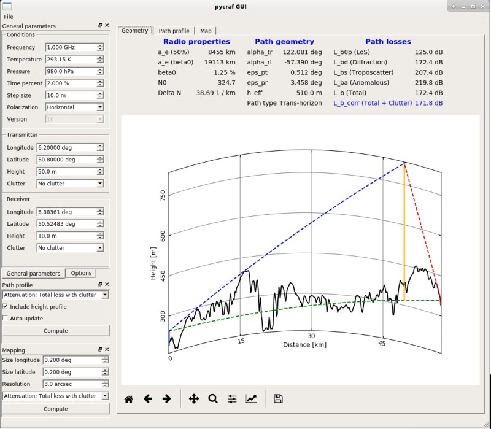

.. _pycraf-gui:

*****************************************************************
Graphical user interface (`pycraf-gui`)
*****************************************************************

.. currentmodule:: pycraf.gui

Introduction
============

The `~pycraf` GUI is a little graphical application, which is shipped with
the Python `~pycraf` package. It can be used to quickly analyze the path
propogation losses along a transmitter-receiver sight-line and plot the path
geometry. It is also possible to compute attenuation maps. At the moment, it
doesn't come with an amazing amount of features, but it is foreseen to add
more in the future.

Using pycraf-gui
================

To run the application, simply run:

.. code-block:: console

    pycraf-gui

.. note::

    As for the `~pycraf.pathprof` sub-package, SRTM tile data is necessary
    to query terrain height profiles. It is possible to have the GUI download
    the tiles automatically. Nevertheless, if you already have SRTM (or other
    .hgt) tiles, you can use them; see also :ref:`working_with_srtm`.

The GUI looks like the following:

In the "General parameters" pane, one can change the environmental properties,
such as temperature and pressure, the desired radio frequency and of course
the location of transmitter and receiver with their antenna heights, etc.
Any change to these numbers will automatically update the "Geometry" display,
i.e., the results of the path loss calculation and the associate path plot.
It is also possible to compute plots of the path losses vs. distance ("Path
profile" pane) and attenuation maps ("Mapping" pane).

Currently, it is possible to save the plots as images (pdf, png, etc.) but it
is not yet possible to export the data into a disk file.

See Also
========

- `Astropy Units and Quantities package <http://docs.astropy.org/en/stable/
  units/index.html>`_, which is used extensively in pycraf.
- `ITU-R Recommendation P.452-16 <https://www.itu.int/rec/
  R-REC-P.452-16-201507-I/en>`_

